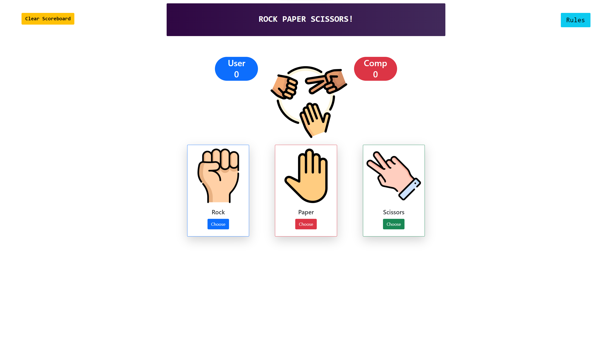
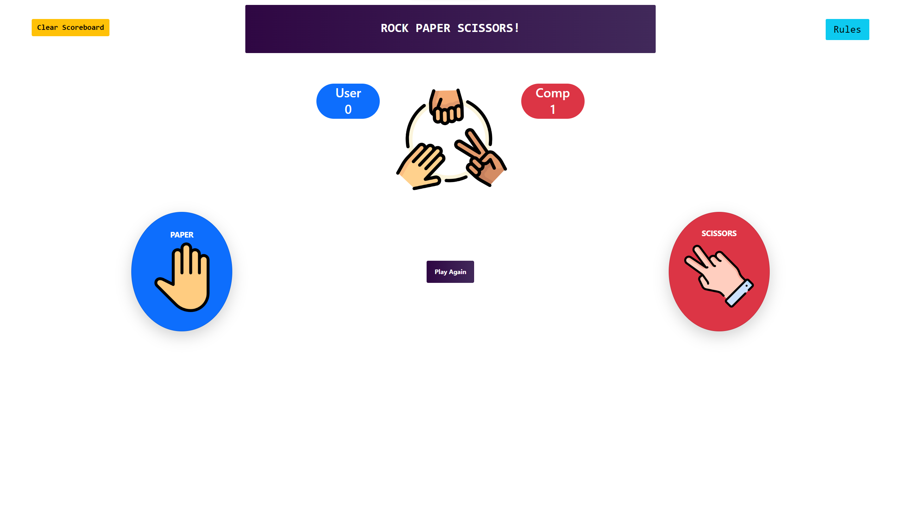

# Project Title

Rock Paper Scissors

Access my site at https://rockpaperscissors.tyler-allen.com

## About The App

[Rock Paper Scissors] is a mobile responsive game playing a computer that randomly chooses a option. The first to 3 points win which with logic behind picking a option and comparing the 2 choices to determine whos score is increased by 1. The score is saved in local storage incase the app is closed.

## Screenshots

## Technologies

  &nbsp;
  &nbsp;
  &nbsp;
  &nbsp;
  &nbsp;

## Approach

Built with React and styled with Bootstrap. react router used to naviagte between the pages with react canvas confetti to display animation on victory of the user. 
